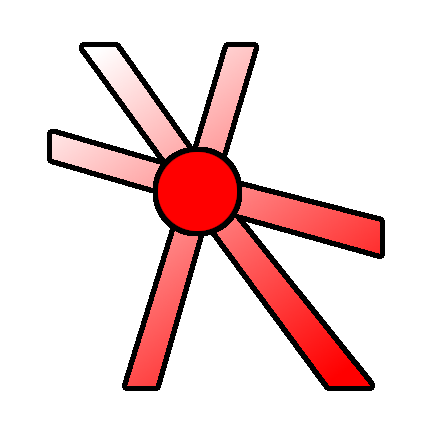

## godot-vertex-painter
 
**A simple tool to paint vertex colors on MeshInstance3Ds.**

[YouTube Video](https://www.youtube.com/watch?v=Qx7UtIk32i8)

---

https://github.com/bikemurt/godot-vertex-painter/assets/23486102/fea58b3f-8b71-48c5-840b-d1ae87ef0f7e

---

**Godot Versions Tested**
- v4.5.stable

---
**V2.1: October 17, 2025**
- Now any Mesh resource can be used as a base
- Moved controls to top of viewport
- Added weight slider
- Added preview of brush size
- Added Undo
- Added blend modes. Currently there are Mix, Add, Subtract and Multiply
- Added Blur tool
- Improved accuracy

**V2.0: May 6, 2024**
- Paint directly on MeshInstance3Ds. StaticBodies are no longer required!
- This is thanks to an updated algorithm to find the 3D surface: https://twitter.com/_michaeljared/status/1787020920751579407
- Interface is improved
- Bucketfill is temporarily removed, let me know if you want this feature

---
## 🚀 Install & Use

1. Download this [repository](https://github.com/bikemurt/godot-vertex-painter/), or download from the [Godot Asset Library](https://godotengine.org/asset-library/asset/2470).
    - Import the addons folder into your project (if it already isn't present).
2. Activate the Vertex Painter addon under Project > Project Settings > Plugins. If an error dialog appears, restart the engine and try activating it again.
3. Add a MeshInstance3D to the scene which you wish to paint vertex colors.
4. Select the MeshInstance3D and click on the "Vertex Paint" button in the toolbar.
5. When finished, click on the "Exit" button to use the editor normally again.

## ⚠️ Limitations

## 🏠 Links

- [Homepage](https://www.michaeljared.ca/)
- [Youtube](https://www.youtube.com/@michaeljburt)
- [Blender Market](https://blendermarket.com/creators/michaeljared)

## 🗒️ License

[MIT License](/LICENSE)
